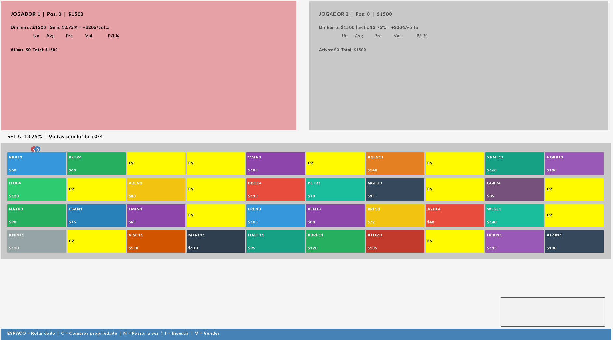

# Ações Imobiliárias

Um jogo desenvolvido em C++ utilizando a biblioteca Raylib.

## 📋 Descrição

[Este trabalho apresenta o desenvolvimento do “Bankov”, um simulador financeiro interativo desenvolvido em C++ utilizando a biblioteca gráfica Raylib. O sistema foi projetado como uma ferramenta educacional que combina elementos de gamificação com conceitos reais do mercado financeiro brasileiro, incluindo ações, fundos imobiliários (FIIs) e a dinâmica da taxa Selic. O jogo permite que dois jogadores interajam em um tabuleiro virtual, tomando decisões de investimento e aprendendo sobre diversificação de portfólio, análise de risco-retorno e comportamento dos mercados. A arquitetura do sistema foi desenvolvida seguindo princípios de programação orientada a objetos, implementando padrões de design que garantem extensibilidade e manutenção do código. Os resultados demonstram que a aplicação consegue simular de forma fidedigna as relações econômicas básicas, como a correlação inversa entre taxa de juros e preços de ativos, proporcionando uma experiência educacional envolvente e tecnicamente robusta.]

## 🛠️ Tecnologias Utilizadas

- **Linguagem:** C++17
- **Framework:** Raylib
- **Build System:** CMake

### Por que usamos o `CMakeLists.txt`?

- **Portabilidade:** o CMake gera arquivos de build para diferentes plataformas e ferramentas (Makefiles, Visual Studio, Ninja), permitindo compilar o mesmo código em Windows, macOS e Linux sem alterar os fontes.
- **Gerenciamento de dependências:** com `find_package()` e variáveis como `CMAKE_PREFIX_PATH` fica mais simples localizar bibliotecas como `raylib` e integrar pacotes (ex.: `vcpkg`).
- **Build fora da árvore (out-of-source):** o CMake incentiva builds em diretórios `build/`, mantendo a árvore de fontes limpa e facilitando múltiplas configurações (Debug/Release) sem conflito.
- **Integração com IDEs/CI:** gera projetos/ninja/soluções que IDEs entendem (Visual Studio, CLion) e é fácil integrar em pipelines de CI (GitHub Actions, Azure Pipelines).
- **Controle de flags e configuração:** centraliza definições de compilador, opções e linkagem (ex.: padrão C++17, includes, libs), simplificando manutenção.

Usar o `CMakeLists.txt` torna o projeto mais fácil de compilar por outros desenvolvedores e em ambientes automatizados, além de facilitar a adição de novas dependências no futuro.

## 📁 Estrutura do Projeto

```
Bankov/
├── CMakeLists.txt
├── src/
│   ├── main.cpp
│   ├── Game.hpp
│   └── assets/
│       └── fonts/
└── README.md
```
## Fotos


## 🚀 Como Compilar

### Pré-requisitos
- CMake (versão 3.10 ou superior)
- Compilador C++17
- Raylib instalado

### Passos para compilar

1. Clone o repositório:
```bash
git clone [git@github.com:WesleySchuab/Bankov.git]
cd Bankov
```

2. Crie o diretório de build:
```bash
mkdir build
cd build
```

3. Configure com CMake:
# Bankov — Ações Imobiliárias

Jogo desenvolvido em C++ que simula operações de compra/venda de propriedades e investimentos (Ações/Stocks). A interface gráfica usa a biblioteca Raylib e o projeto é construído com CMake.

**Status:** Código fonte disponível. Instruções de compilação e execução abaixo.

**Funcionalidades principais**
- Comprar e vender propriedades
- Investimentos em ações/ativos
- Turnos de jogadores e eventos aleatórios

**Tecnologias**
- Linguagem: `C++17`
- Biblioteca gráfica: `raylib`
- Sistema de build: `CMake`

**Estrutura do repositório (resumida)**
```
Bankov/
├── CMakeLists.txt
├── README.md
├── src/
│   ├── main.cpp
│   ├── Game.cpp / Game.hpp
│   ├── Board.cpp / Board.hpp
│   ├── Player.cpp / Player.hpp
│   ├── Property.cpp / Property.hpp
│   └── assets/
│       ├── fonts/
│       └── images/
└── build/    (diretório gerado pelo CMake)
```

**Pré-requisitos**
- `CMake` (3.10+ recomendado)
- Compilador com suporte a C++17 (MSVC, GCC, Clang)
- `raylib` instalado na sua máquina (ou via gerenciador de pacotes)

Se você estiver no Windows, pode instalar o `raylib` via `vcpkg`, `msys2` ou compilá-lo manualmente. No Linux/macOS use o gerenciador de pacotes da sua distro ou compile a partir das fontes.

## Como compilar (instruções rápidas)

Abra um terminal (`pwsh.exe` no Windows) na raiz do projeto `C:\Users\wesley\Bankov`.

1) Clone (se ainda não tiver):
```powershell
git clone --recurse-submodules git@github.com:WesleySchuab/Bankov.git
cd Bankov
```

2) Criar diretório de build e configurar com CMake:
```powershell
mkdir build
cd build
cmake ..
```

Se você usa MSVC no Windows e quer gerar solução Visual Studio, especifique o gerador (exemplo):
```powershell
# Exemplo: usar Visual Studio 2019 x64
cmake -G "Visual Studio 16 2019" -A x64 ..
```

3) Compilar:
```powershell
# build recomendado (todos os geradores):
cmake --build . --config Release
```

4) Executar o binário gerado (exemplo path relativo ao build):
```powershell
# ajuste o caminho se o executável estiver em outra pasta
./bin/Bankov.exe
# ou, no caso de gerar com Visual Studio
./Release/Bankov.exe
```
5) Para desenvolver esse jogo, configurei o visual studio com o terminal w64devkit que ja vem no raylib 
# compilei com o comando 
## g++ -I./src -o jogo.exe src/*.cpp -lraylib -lopengl32 -lgdi32 -lwinmm

## Controles e Jogabilidade
- Use a tecla de espaço para rolar o dado
- Durante o jogo, siga as instruções na tela para comprar/vender ou terminar o turno

Observação: os controles exatos dependem da implementação em `src/` — consulte `Game.cpp` e `main.cpp` para detalhes.

## Desenvolvimento

Como contribuir localmente:
1. Crie uma branch para sua feature/bugfix:
```powershell
git checkout -b feat/nome-da-feature
```
2. Faça mudanças, compile e teste localmente.
3. Commit e push:
```powershell
git add .
git commit -m "Descrição curta da mudança"
git push -u origin feat/nome-da-feature
```
4. Abra um Pull Request no GitHub.

## Problemas comuns
- Erro de `raylib` não encontrado: verifique se `raylib` está instalado e se `CMAKE_PREFIX_PATH` ou variáveis de sistema apontam para a instalação.
- Erro no `cmake`: tente limpar `build` e rodar `cmake ..` de novo.


## Autor
Wesley Schuab — contato: [wesleyschuabvieira@gmail.com]

---


